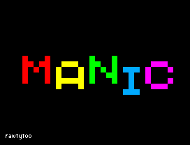
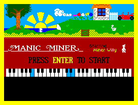

# MANIC MINER

## About

Originally written in 1983 by Matthew Smith. This port is based on the original
ZX Spectrum version, written in C and using the SDL2 library.

## Game play

Game play is 100% identical except for the following differences:

- Level 16 has the item below the portal slightly lower down and the conveyor
has a gap. This forces the player to utilise the left side of the level to get
the item and to return to the portal. Judging by the collapsible blocks on the
left, this may have been what Matthew Smith originally envisioned.

- In level 19 "Solar Power Generator", air depletes by 8 points if Willy is hit
by the light beam unless his Y position is offset and the light beam strikes him
vertically, then he loses 12 points of air. That's how the original game works.
It should not matter if Willy's Y position is offset as he takes up no more room
visually, therefore air depletes by 8 points regardless.

- The original game had bugs. These have been fixed, such as landing at the end
of a jump into a solid wall.

## Video & Audio

Some subtle improvements have been made to make the game more enjoyable:

- Per pixel colouring. This eliminates colour clashing.
- 16 colour palette.
- 2 replacement character set fonts; one small, one large.
- The piano keyboard on the title screen has been corrected.
- The title screen has been redrawn in places for a more balanced look.
- The title and in-game music scores have been reproduced and are polyphonic.
- The sound effects are approximately the same as in the original game and
include stereo panning effects.
- To give the music and sound effects a retro feel, a square wave generator is
used to give it a "beepy" sound.

## Cheat mode

Cheat mode is activated just like in the original game by typing the code. Once
activated, switching levels is as simple.

The keyboard numbers 1 to 0 are levels 1 to 10, and the Shift key changes
that to levels 11 to 20. Then press Enter to change level. These key
combinations need to be pressed simultaneously.

# Linux
## Debian
- Install the packages `libsdl2-dev build-essential`
- Then type `make` at a command prompt.

# Windows
A pre-built 64bit executable can be found at [MM and JSW ports to SDL2](https://jswmm.co.uk/topic/791-mm-and-jsw-ports-to-sdl2/).
